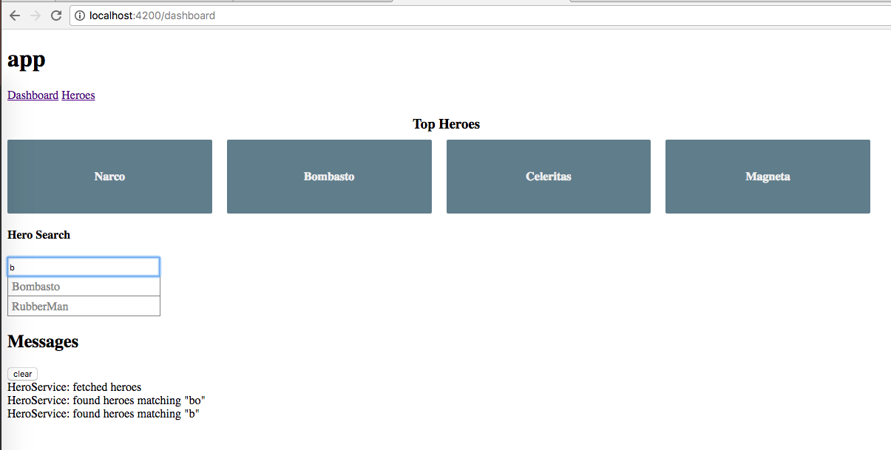

# Angular 5 Tutorial Project

## Screenshots

# Angular

Angular is a development platform for building mobile and desktop web applications using Typescript/JavaScript and other languages.

## Quickstart

[Get started in 5 minutes][quickstart].

[browserstack]: https://www.browserstack.com/automate/public-build/LzF3RzBVVGt6VWE2S0hHaC9uYllOZz09LS1BVjNTclBKV0x4eVRlcjA4QVY1M0N3PT0=--eb4ce8c8dc2c1c5b2b5352d473ee12a73ac20e06
[contributing]: http://github.com/angular/angular/blob/master/CONTRIBUTING.md
[quickstart]: https://angular.io/docs/ts/latest/quickstart.html
[ng]: http://angular.io
